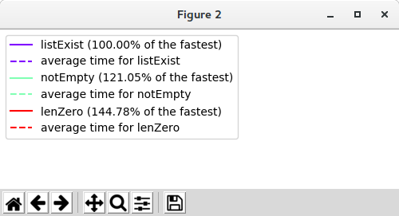
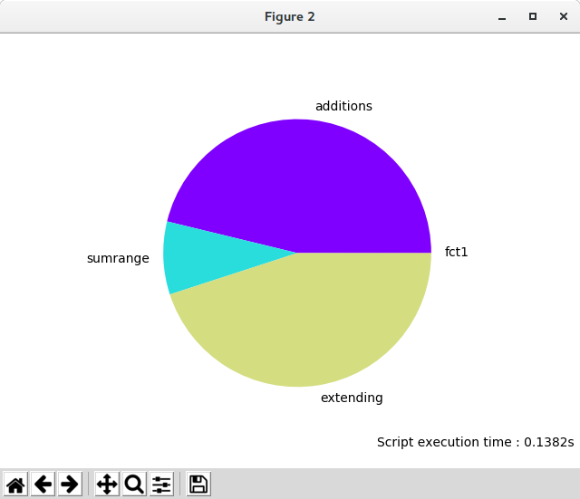
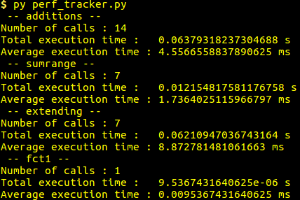

#  Bench
Timer, benchmark and ressource usage tracker.
A tool for python functions. Time and compare your functions inside or outside a program.


## Benchmark

Allows to run multiple python functions a certain amount of times and to compare there respective execution times.
Similar to [timeit](https://docs.python.org/2/library/timeit.html) Display curves of all the execution times.
Prototype : benchmarking for complexity tests up to one variable parameter. The variable take all the values of a given range and the benchmarck keeps track of the executions times.





#### Usage :
```
bm = Benchmark()
bm.add(fct1, *args, **kwargs)
bm.add(fct2, *args, **kwargs)
bm.add(fctn, *args, **kwargs)
bm.run(20, multiplicator=100)
```

#### Quick usage :
```
bm = Benchmark([fct1, fct2], 300)
```

### Examples
More examples available in ```benchmark_examples.py```.

```
def plusEgale(i=1):
    i += 1
    return i

def plusPuisEgale(i=1):
    i = i + 1
    return i

# running 200 tests 100000 times each
bm = Benchmark()
bm.add(plusEgale, 42)
bm.add(plusPuisEgale, 42)
bm.run(200, multiplicator=100000)

# short version for procedures
bm = Benchmark([plusEgale, plusPuisEgale], 200, multiplicator=100000)
```

## Tracker
Allow to keep track of the execution time of some functions in a program. Useful to know which part of your program take the more time to execute.






#### Usage
Use the decorator ```@execTimeList``` before every function you want to keep track of.
The execution time of a function is defined by the total execution time of the code and of the functions called inside that are not taged with ```@execTimeList```.
Use ```display_performances()``` to display the results.

### Examples
```
@execTimeList
def additions():
    i = 0
    for x in range(1,100000):
        i += 1

@execTimeList
def sumrange():
    sum(range(1,100000))

@execTimeList
def extending():
    l = []
    for x in range(1,100000):
        l.extend([0])

@execTimeList
def fct1():
    extending()
    sumrange()

# simulate some basic code
for x in range(4):
    additions()
    sumrange()
    extending()
for x in range(2):
    sumrange()
    extending()
for x in range(10):
    additions()
fct1()

display_performances()
```

_______________________________________________________
Author : Thibault Charmet
Creation date : 09/2018

